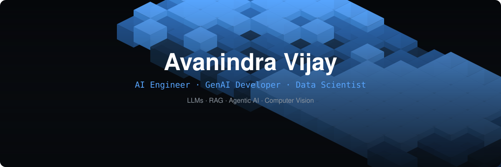

<div align="center">



# Avanindra Vijay

**AI Engineer · GenAI Developer · Data Scientist**

Building practical AI systems — LLMs, RAG, Agentic AI, Computer Vision

[](https://github.com/AvanindraVijay)
[](https://www.linkedin.com/in/vijayavanindra/)
[](https://portfolio-ga9f.onrender.com/)


</div>

---

## About

I build practical AI systems around Generative AI, LLMs, RAG, Agentic AI, and Computer Vision.

My work focuses on turning AI models into usable software through Python, FastAPI, PostgreSQL, vector search, APIs, and cloud-native deployment.

---

## Engineering Stack

<div align="center">


</div>

**AI / ML**
`Generative AI` `LLMs` `RAG` `LangChain` `LangGraph` `Transformers` `NLP` `Computer Vision` `YOLO` `OCR`

**Backend / Data**
`Python` `FastAPI` `PostgreSQL` `FAISS` `BM25` `Pandas` `Plotly` `REST APIs`

**Cloud / DevOps**
`Docker` `Kubernetes` `Azure` `Git` `GitHub`

---

## Selected Work

**AI-Powered Inspection System**
Computer vision system that analyzes mechanic-uploaded images and compares detected lift components against expected order/BOM data.
Detection: YOLO, OCR, Image Matching · Backend: FastAPI, PostgreSQL · Interface: Microsoft Power Apps

**RAG & Agentic AI Systems**
Context-aware AI applications built with retrieval pipelines, vector search, conversational memory, and graph-based workflows.
Stack: LangChain, LangGraph, FAISS, BM25, PostgreSQL, Local LLMs

**Natural Language → SQL**
AI-powered analytics system that converts natural-language questions into validated, executable PostgreSQL queries.
Stack: LLM, RAG, PostgreSQL, FastAPI, Plotly

---

## AI Architecture

```mermaid
flowchart TD
    A[USER] --> B["AI API<br/>FastAPI"]
    B --> C[RAG]
    B --> D[AGENTS]
    B --> E[VISION]
    C --> F[("Vector DB")]
    D --> G[LangGraph]
    E --> H[YOLO]
    F --> I[LLM]
    G --> I
    H --> I
    I --> J[AI RESPONSE]

    style A fill:#58a6ff,stroke:#161b22,stroke-width:2px,color:#0d1117
    style B fill:#2f6fbd,stroke:#161b22,stroke-width:2px,color:#ffffff
    style C fill:#1b3a5c,stroke:#161b22,stroke-width:2px,color:#ffffff
    style D fill:#1b3a5c,stroke:#161b22,stroke-width:2px,color:#ffffff
    style E fill:#1b3a5c,stroke:#161b22,stroke-width:2px,color:#ffffff
    style F fill:#12233b,stroke:#161b22,stroke-width:2px,color:#ffffff
    style G fill:#12233b,stroke:#161b22,stroke-width:2px,color:#ffffff
    style H fill:#12233b,stroke:#161b22,stroke-width:2px,color:#ffffff
    style I fill:#58a6ff,stroke:#161b22,stroke-width:2px,color:#0d1117
    style J fill:#2f6fbd,stroke:#161b22,stroke-width:2px,color:#ffffff
```mermaid

---

## 3D Contribution Graph

<div align="center">

</div>

---

## Stats

<div align="center">

</div>

---

## Recent Activity

<!--START_SECTION:activity-->
<!--END_SECTION:activity-->

---

## Latest Blog Posts

<!-- BLOG-POST-LIST:START -->
<!-- BLOG-POST-LIST:END -->

---

## Currently Exploring

`Multimodal LLMs` `Agentic AI` `LLM Optimization` `Computer Vision` `Kubernetes` `Cloud AI`

---

<div align="center">


**Build · Learn · Ship**

Thanks for stopping by — feel free to explore the repos below!

</div>
