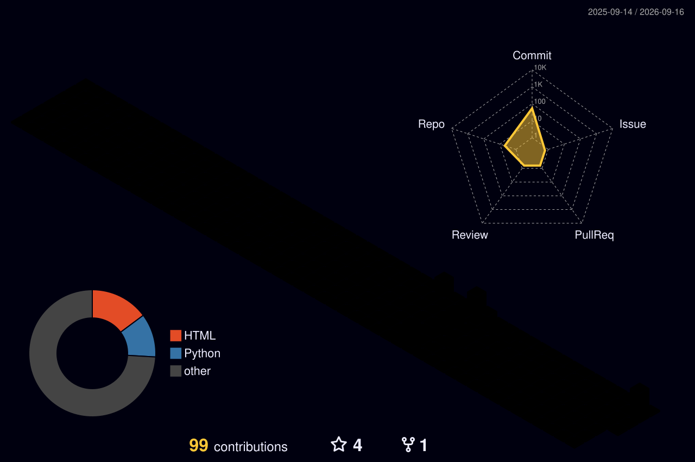

AVANINDRA VIJAY

AI Engineer · GenAI Developer · Data Scientist

 
---

About

I build practical AI systems around Generative AI, LLMs, RAG, Agentic AI, and Computer Vision.

My work focuses on turning AI models into usable software through Python, FastAPI, PostgreSQL, vector search, APIs, and cloud-native deployment.

---

Engineering Stack

AI / ML

"Generative AI" "LLMs" "RAG" "LangChain" "LangGraph"
"Transformers" "NLP" "Computer Vision" "YOLO" "OCR"

Backend / Data

"Python" "FastAPI" "PostgreSQL" "FAISS" "BM25"
"Pandas" "Plotly" "REST APIs"

Cloud / DevOps

"Docker" "Kubernetes" "Azure" "Git" "GitHub"

---

Selected Work

AI-Powered Inspection System

Computer vision system that analyzes mechanic-uploaded images and compares detected lift components against expected order/BOM data.

Detection: YOLO · OCR · Image Matching
Backend: FastAPI · PostgreSQL
Interface: Microsoft Power Apps

---

RAG & Agentic AI Systems

Built context-aware AI applications using retrieval pipelines, vector search, conversational memory, and graph-based workflows.

Stack: LangChain · LangGraph · FAISS · BM25 · PostgreSQL · Local LLMs

---

Natural Language → SQL

AI-powered analytics system that converts natural-language questions into validated and executable PostgreSQL queries.

Stack: LLM · RAG · PostgreSQL · FastAPI · Plotly

---

AI Architecture

                    USER
                      │
                      ▼
              ┌───────────────┐
              │   AI API      │
              │   FastAPI     │
              └───────┬───────┘
                      │
          ┌───────────┼───────────┐
          ▼           ▼           ▼
       RAG         AGENTS       VISION
          │           │           │
          ▼           ▼           ▼
      Vector DB    LangGraph     YOLO
          │           │           │
          └───────────┼───────────┘
                      ▼
                    LLM
                      │
                      ▼
                AI RESPONSE

---

GitHub Activity

---

GitHub Statistics

---

3D Contribution Graph

---

Currently Exploring

"Multimodal LLMs" · "Agentic AI" · "LLM Optimization"
"Computer Vision" · "Kubernetes" · "Cloud AI"

---

BUILD · LEARN · SHIP

